# ESPHome Intercom API

A flexible intercom framework for ESP32 devices - from simple full-duplex doorbell to PBX-like multi-device system.


<table>
  <tr>
    <td align="center"><br/><b>Idle</b></td>
    <td align="center"><br/><b>Calling</b></td>
    <td align="center"><br/><b>Ringing</b></td>
    <td align="center"><br/><b>In Call</b></td>
  </tr>
</table>

## Table of Contents

- [Overview](#overview)
- [Features](#features)
- [Architecture](#architecture)
- [Installation](#installation)
  - [1. Home Assistant Integration](#1-home-assistant-integration)
  - [2. ESPHome Component](#2-esphome-component)
  - [3. Lovelace Card](#3-lovelace-card)
- [Operating Modes](#operating-modes)
  - [Simple Mode](#simple-mode-browser--esp)
  - [Full Mode](#full-mode-esp--esp)
- [Configuration Reference](#configuration-reference)
- [Entities and Controls](#entities-and-controls)
- [Call Flow Diagrams](#call-flow-diagrams)
- [Hardware Support](#hardware-support)
- [Troubleshooting](#troubleshooting)
- [License](#license)

---

## Overview

**Intercom API** is a scalable full-duplex ESPHome intercom framework that grows with your needs:

| Use Case | Configuration | Description |
|----------|---------------|-------------|
| 🔔 **Simple Doorbell** | 1 ESP + Browser | Ring notification, answer from phone/PC |
| 🏠 **Home Intercom** | Multiple ESPs | Call between rooms (Kitchen ↔ Bedroom) |
| 📞 **PBX-like System** | ESPs + Browser + HA | Full intercom network with Home Assistant as a participant |

**Home Assistant acts as the central hub** - it can receive calls (doorbell), make calls to ESPs, and relay calls between devices. All audio flows through HA, enabling remote access without complex NAT/firewall configuration.

```mermaid
graph TD
    HA[🏠 Home Assistant<br/>PBX hub]
    ESP1[📻 ESP #1<br/>Kitchen]
    ESP2[📻 ESP #2<br/>Bedroom]
    Browser[🌐 Browser<br/>Phone]

    HA <--> ESP1
    HA <--> ESP2
    HA <--> Browser
```



### Why This Project?

This component was born from the limitations of [esphome-intercom](https://github.com/n-IA-hane/esphome-intercom), which uses direct ESP-to-ESP UDP communication. That approach works great for local networks but fails in these scenarios:

- **Remote access**: WebRTC/go2rtc fails through NAT without port forwarding
- **Complex setup**: Requires go2rtc server, STUN/TURN configuration
- **Browser limitations**: WebRTC permission and codec issues

**Intercom API** solves these problems:

- Uses ESPHome's native API for control (port 6053)
- Opens a dedicated TCP socket for audio streaming (port 6054)
- **Works remotely** - Audio streams through HA's WebSocket, so Nabu Casa/reverse proxy/VPN all work
- No WebRTC, no go2rtc, no port forwarding required

---

## Features

- **Full-duplex audio** - Talk and listen simultaneously
- **Two operating modes**:
  - **Simple**: Browser ↔ Home Assistant ↔ ESP
  - **Full**: ESP ↔ Home Assistant ↔ ESP (intercom between devices)
- **Echo Cancellation (AEC)** - Built-in acoustic echo cancellation using ESP-SR
  *(ES8311 digital feedback mode provides perfect sample-accurate echo cancellation)*
- **Auto Answer** - Configurable automatic call acceptance
- **Volume Control** - Adjustable speaker volume and microphone gain
- **Contact Management** - Select call destination from discovered devices
- **Status LED** - Visual feedback for call states
- **Persistent Settings** - Volume, gain, AEC state saved to flash
- **Remote Access** - Works through any HA remote access method

---

## Architecture

### System Overview

```mermaid
graph TB
    subgraph HA[🏠 HOME ASSISTANT]
        subgraph Integration[intercom_native integration]
            WS[WebSocket API<br/>/start /stop /audio]
            TCP[TCP Client<br/>Port 6054<br/>Async queue]
            Bridge[Auto-Bridge<br/>Full Mode<br/>ESP↔ESP relay]
        end
    end

    subgraph Browser[🌐 Browser]
        Card[Lovelace Card<br/>AudioWorklet<br/>getUserMedia]
    end

    subgraph ESP[📻 ESP32]
        API[intercom_api<br/>FreeRTOS Tasks<br/>I2S mic/spk]
    end

    Card <-->|WebSocket<br/>JSON+Base64| WS
    API <-->|TCP :6054<br/>Binary PCM| TCP
```



### Audio Format

| Parameter | Value |
|-----------|-------|
| Sample Rate | 16000 Hz |
| Bit Depth | 16-bit signed PCM |
| Channels | Mono |
| ESP Chunk Size | 512 bytes (256 samples = 16ms) |
| Browser Chunk Size | 2048 bytes (1024 samples = 64ms) |
| Round-trip Latency | < 500ms |

### TCP Protocol (Port 6054)

**Header (4 bytes):**

| Byte 0 | Byte 1 | Bytes 2-3 |
|--------|--------|-----------|
| Type | Flags | Length (LE) |

**Message Types:**

| Code | Name | Description |
|------|------|-------------|
| 0x01 | AUDIO | PCM audio data |
| 0x02 | START | Start streaming (includes caller_name, no_ring flag) |
| 0x03 | STOP | Stop streaming |
| 0x04 | PING | Keep-alive |
| 0x05 | PONG | Keep-alive response |
| 0x06 | ERROR | Error notification |

---

## Installation

### 1. Home Assistant Integration

#### Copy the integration files

```bash
# From the repository root
cp -r homeassistant/custom_components/intercom_native /config/custom_components/
```

#### Add to configuration.yaml

**This step is required!** The integration must be declared in your `configuration.yaml`:

```yaml
# configuration.yaml
intercom_native:
```

That's it - no additional configuration needed. The integration will:
- Register WebSocket API commands for the card
- Create `sensor.intercom_active_devices` (lists all intercom ESPs)
- Auto-detect ESP state changes for Full Mode bridging

#### Restart Home Assistant

After adding the configuration, restart Home Assistant completely.

### 2. ESPHome Component

Add the external component to your ESPHome device configuration:

```yaml
external_components:
  - source:
      type: git
      url: https://github.com/n-IA-hane/intercom-api
      ref: main
      path: esphome_components
    components: [intercom_api, esp_aec]
```

#### Minimal Configuration (Simple Mode)

```yaml
esp32:
  board: esp32-s3-devkitc-1
  framework:
    type: esp-idf
    sdkconfig_options:
      # Default is 10, increased for: TCP server + API + OTA
      CONFIG_LWIP_MAX_SOCKETS: "16"

# I2S Audio (example with separate mic/speaker)
i2s_audio:
  - id: i2s_mic_bus
    i2s_lrclk_pin: GPIO3
    i2s_bclk_pin: GPIO2
  - id: i2s_spk_bus
    i2s_lrclk_pin: GPIO6
    i2s_bclk_pin: GPIO7

microphone:
  - platform: i2s_audio
    id: mic_component
    i2s_audio_id: i2s_mic_bus
    i2s_din_pin: GPIO4
    adc_type: external
    pdm: false
    bits_per_sample: 32bit
    sample_rate: 16000

speaker:
  - platform: i2s_audio
    id: spk_component
    i2s_audio_id: i2s_spk_bus
    i2s_dout_pin: GPIO8
    dac_type: external
    sample_rate: 16000
    bits_per_sample: 16bit

# Echo Cancellation (recommended)
esp_aec:
  id: aec_processor
  sample_rate: 16000
  filter_length: 4       # 64ms tail length
  mode: voip_low_cost    # Optimized for real-time

# Intercom API - Simple mode (browser only)
intercom_api:
  id: intercom
  mode: simple
  microphone: mic_component
  speaker: spk_component
  aec_id: aec_processor
```

#### Full Configuration (Full Mode with ESP↔ESP)

```yaml
intercom_api:
  id: intercom
  mode: full                  # Enable ESP↔ESP calls
  microphone: mic_component
  speaker: spk_component
  aec_id: aec_processor
  ringing_timeout: 30s        # Auto-decline unanswered calls

  # FSM event callbacks
  on_incoming_call:
    - light.turn_on:
        id: status_led
        effect: "Ringing"

  on_outgoing_call:
    - light.turn_on:
        id: status_led
        effect: "Calling"

  on_streaming:
    - light.turn_on:
        id: status_led
        red: 0%
        green: 100%
        blue: 0%

  on_idle:
    - light.turn_off: status_led

# Switches (with restore from flash)
switch:
  - platform: intercom_api
    intercom_api_id: intercom
    auto_answer:
      name: "Auto Answer"
      restore_mode: RESTORE_DEFAULT_OFF
    aec:
      name: "Echo Cancellation"
      restore_mode: RESTORE_DEFAULT_ON

# Volume controls
number:
  - platform: intercom_api
    intercom_api_id: intercom
    speaker_volume:
      name: "Speaker Volume"
    mic_gain:
      name: "Mic Gain"

# Buttons for manual control
button:
  - platform: template
    name: "Call"
    on_press:
      - intercom_api.call_toggle:
          id: intercom

  - platform: template
    name: "Next Contact"
    on_press:
      - intercom_api.next_contact:
          id: intercom

# Subscribe to HA's contact list (Full mode)
text_sensor:
  - platform: homeassistant
    id: ha_active_devices
    entity_id: sensor.intercom_active_devices
    on_value:
      - intercom_api.set_contacts:
          id: intercom
          contacts_csv: !lambda 'return x;'
```

### 3. Lovelace Card

#### Copy the card files

```bash
cp frontend/www/intercom-card.js /config/www/
cp frontend/www/intercom-processor.js /config/www/
```

#### Add as Lovelace resource

Go to **Settings → Dashboards → Resources** (or edit `configuration.yaml`):

```yaml
lovelace:
  resources:
    - url: /local/intercom-card.js
      type: module
```

#### Add the card to your dashboard


```yaml
type: custom:intercom-card
entity_id: <your_esp_device_id>
name: Kitchen Intercom
mode: full  # or 'simple'
```

The card automatically discovers ESPHome devices with the `intercom_api` component.

> **Note**: Devices must be added to Home Assistant via the ESPHome integration before they appear in the card.


---

## Operating Modes

### Simple Mode (Browser ↔ ESP)

In Simple mode, the browser communicates directly with a single ESP device through Home Assistant. If the ESP has **Auto Answer** enabled, streaming starts automatically when you call.

```mermaid
graph LR
    Browser[🌐 Browser] <-->|WebSocket| HA[🏠 HA]
    HA <-->|TCP 6054| ESP[📻 ESP]
```




**Call Flow (Browser → ESP):**
1. User clicks "Call" in browser
2. Card sends `intercom_native/start` to HA
3. HA opens TCP connection to ESP:6054
4. HA sends START message (caller="Home Assistant")
5. ESP enters Ringing state (or auto-answers)
6. Bidirectional audio streaming begins

**Call Flow (ESP → Browser):**
1. User presses "Call" on ESP (with destination set to "Home Assistant")
2. ESP sends RING message to HA
3. HA notifies all connected browser cards
4. Card shows incoming call with Answer/Decline buttons
5. User clicks "Answer" in browser
6. Bidirectional audio streaming begins

**Use Simple mode when:**
- You only have one intercom device
- You need browser-to-ESP **and** ESP-to-browser communication
- You want minimal configuration

### Full Mode (PBX-like)

Full mode includes everything from Simple mode (Browser ↔ ESP calls) **plus** enables a PBX-like system where ESP devices can also call each other through Home Assistant, which acts as an audio relay.

```mermaid
graph TB
    ESP1[📻 ESP #1<br/>Kitchen] <-->|TCP 6054| HA[🏠 HA<br/>PBX hub]
    ESP2[📻 ESP #2<br/>Bedroom] <-->|TCP 6054| HA
    Browser[🌐 Browser/App] <-->|WebSocket| HA
```




**Call Flow (ESP #1 calls ESP #2):**
1. User selects "Bedroom" on ESP #1 display/button
2. User presses Call button → ESP #1 enters "Outgoing" state
3. HA detects state change via ESPHome API
4. HA sends START to ESP #2 (caller="Kitchen")
5. ESP #2 enters "Ringing" state
6. User answers on ESP #2 (or auto-answer)
7. HA bridges audio: ESP #1 ↔ HA ↔ ESP #2
8. Either device can hangup → STOP propagates to both

**Full mode features:**
- Contact list auto-discovery from HA
- Next/Previous contact navigation
- Caller ID display
- Ringing timeout with auto-decline
- Bidirectional hangup propagation

### ESP calling Home Assistant (Doorbell)

When an ESP device has "Home Assistant" selected as destination and initiates a call, it fires an event for notifications:


---

## Configuration Reference

### intercom_api Component

| Option | Type | Default | Description |
|--------|------|---------|-------------|
| `id` | ID | Required | Component ID |
| `mode` | string | `simple` | `simple` (browser only) or `full` (ESP↔ESP) |
| `microphone` | ID | Required | Reference to microphone component |
| `speaker` | ID | Required | Reference to speaker component |
| `aec_id` | ID | - | Reference to esp_aec component |
| `mic_bits` | int | 16 | Microphone bit depth (16 or 32) |
| `dc_offset_removal` | bool | false | Remove DC offset (for mics like SPH0645) |
| `ringing_timeout` | time | 0s | Auto-decline after timeout (0 = disabled) |

### Event Callbacks

| Callback | Trigger | Use Case |
|----------|---------|----------|
| `on_incoming_call` | Received START with ring | Turn on ringing LED/sound |
| `on_outgoing_call` | User initiated call | Show "Calling..." status |
| `on_ringing` | Waiting for answer | Blink LED pattern |
| `on_answered` | Call was answered | Log event |
| `on_streaming` | Audio streaming active | Solid LED, enable amp |
| `on_idle` | Call ended | Turn off LED, disable amp |
| `on_hangup` | Call terminated | Log with reason |
| `on_call_failed` | Call failed | Show error |

### Actions

| Action | Description |
|--------|-------------|
| `intercom_api.start` | Start outgoing call |
| `intercom_api.stop` | Hangup current call |
| `intercom_api.answer_call` | Answer incoming call |
| `intercom_api.decline_call` | Decline incoming call |
| `intercom_api.call_toggle` | Smart: idle→call, ringing→answer, streaming→hangup |
| `intercom_api.next_contact` | Select next contact (Full mode) |
| `intercom_api.prev_contact` | Select previous contact (Full mode) |
| `intercom_api.set_contacts` | Update contact list from CSV |

### Conditions

| Condition | Returns true when |
|-----------|-------------------|
| `intercom_api.is_idle` | State is Idle |
| `intercom_api.is_ringing` | State is Ringing (incoming) |
| `intercom_api.is_calling` | State is Outgoing (waiting answer) |
| `intercom_api.is_in_call` | State is Streaming (active call) |
| `intercom_api.is_incoming` | Has incoming call |

### esp_aec Component

| Option | Type | Default | Description |
|--------|------|---------|-------------|
| `id` | ID | Required | Component ID |
| `sample_rate` | int | 16000 | Must match audio sample rate |
| `filter_length` | int | 4 | Echo tail in frames (4 = 64ms) |
| `mode` | string | `voip_low_cost` | AEC algorithm mode |

**AEC modes:**
- `voip_low_cost` - Optimized for real-time voice, lower CPU
- `voip` - Standard VoIP quality
- `speex` - Speex-based algorithm

---

## Entities and Controls

### Auto-created Entities (always)

| Entity | Type | Description |
|--------|------|-------------|
| `sensor.{name}_intercom_state` | Text Sensor | Current state: Idle, Ringing, Streaming, etc. |

### Auto-created Entities (Full mode only)

| Entity | Type | Description |
|--------|------|-------------|
| `sensor.{name}_destination` | Text Sensor | Currently selected contact |
| `sensor.{name}_caller` | Text Sensor | Who is calling (during incoming call) |
| `sensor.{name}_contacts` | Text Sensor | Contact count |

### Platform Entities (declared in YAML)

| Platform | Entities |
|----------|----------|
| `switch` | `auto_answer`, `aec` |
| `number` | `speaker_volume` (0-100%), `mic_gain` (-20 to +20 dB) |
| `button` | Call, Next Contact, Prev Contact, Decline (template) |

---

## Call Flow Diagrams

### Simple Mode: Browser calls ESP

```mermaid
sequenceDiagram
    participant B as 🌐 Browser
    participant HA as 🏠 Home Assistant
    participant E as 📻 ESP

    B->>HA: WS: start {host: "esp.local"}
    HA->>E: TCP Connect :6054
    HA->>E: START {caller:"HA"}
    Note right of E: State: Ringing<br/>(or auto-answer)
    E-->>HA: PONG (answered)
    Note right of E: State: Streaming

    loop Bidirectional Audio
        B->>HA: WS: audio (base64)
        HA->>E: TCP: AUDIO (PCM) → Speaker
        E->>HA: TCP: AUDIO (PCM) ← Mic
        HA->>B: WS: audio_event
    end

    B->>HA: WS: stop
    HA->>E: TCP: STOP
    Note right of E: State: Idle
```



### Full Mode: ESP calls ESP

```mermaid
sequenceDiagram
    participant E1 as 📻 ESP #1 (Caller)
    participant HA as 🏠 Home Assistant
    participant E2 as 📻 ESP #2 (Callee)

    Note left of E1: State: Outgoing<br/>(user pressed Call)
    E1->>HA: ESPHome API state change
    HA->>E2: TCP Connect :6054
    HA->>E2: START {caller:"ESP1"}
    Note right of E2: State: Ringing
    HA->>E1: TCP Connect :6054
    HA->>E1: START {caller:"ESP2"}
    Note left of E1: State: Ringing

    E2-->>HA: PONG (user answered)
    Note right of E2: State: Streaming
    HA-->>E1: PONG
    Note left of E1: State: Streaming

    loop Bridge relays audio
        E1->>HA: AUDIO (mic)
        HA->>E2: AUDIO → Speaker
        E2->>HA: AUDIO (mic)
        HA->>E1: AUDIO → Speaker
    end

    E1->>HA: STOP (hangup)
    HA->>E2: STOP
    Note left of E1: State: Idle
    Note right of E2: State: Idle
```



---

## Hardware Support

### Tested Configurations

| Device | Microphone | Speaker | I2S Mode | Component |
|--------|------------|---------|----------|-----------|
| ESP32-S3 Mini | SPH0645 | MAX98357A | Dual bus | `i2s_audio` |
| Xiaozhi Ball V3 | ES8311 | ES8311 | Single bus | `i2s_audio_duplex` |

### Requirements

- **ESP32-S3** with PSRAM (required for AEC)
- I2S microphone (INMP441, SPH0645, ES8311, etc.)
- I2S speaker amplifier (MAX98357A, ES8311, etc.)
- ESP-IDF framework (not Arduino)

### Single-Bus Codecs (ES8311, ES8388, WM8960)

Many integrated codecs use a single I2S bus for both mic and speaker. Standard ESPHome `i2s_audio` **cannot handle this**. Use the included `i2s_audio_duplex` component:

```yaml
external_components:
  - source:
      type: git
      url: https://github.com/n-IA-hane/intercom-api
      ref: main
      path: esphome_components
    components: [intercom_api, i2s_audio_duplex, esp_aec]

i2s_audio_duplex:
  id: i2s_duplex
  i2s_lrclk_pin: GPIO45
  i2s_bclk_pin: GPIO9
  i2s_mclk_pin: GPIO16
  i2s_din_pin: GPIO10
  i2s_dout_pin: GPIO8
  sample_rate: 16000

microphone:
  - platform: i2s_audio_duplex
    id: mic_component
    i2s_audio_duplex_id: i2s_duplex

speaker:
  - platform: i2s_audio_duplex
    id: spk_component
    i2s_audio_duplex_id: i2s_duplex
```

See the [i2s_audio_duplex README](esphome_components/i2s_audio_duplex/README.md) for detailed configuration.

---

## Troubleshooting

### Card shows "No devices found"

1. Verify `intercom_native:` is in `configuration.yaml`
2. Restart Home Assistant after adding the integration
3. Ensure ESP device is connected via ESPHome integration
4. Check ESP has `intercom_api` component configured
5. Clear browser cache and reload

### No audio from ESP speaker

1. Check speaker wiring and I2S pin configuration
2. Verify `speaker_enable` GPIO if your amp has an enable pin
3. Check volume level (default 80%)
4. Look for I2S errors in ESP logs

### No audio from browser

1. Check browser microphone permissions
2. Verify HTTPS (required for getUserMedia)
3. Check browser console for AudioContext errors
4. Try a different browser (Chrome recommended)

### Echo or feedback

1. Enable AEC: create `esp_aec` component and link with `aec_id`
2. Ensure AEC switch is ON in Home Assistant
3. Reduce speaker volume
4. Increase physical distance between mic and speaker

### High latency

1. Check WiFi signal strength (should be > -70 dBm)
2. Verify Home Assistant is not overloaded
3. Check for network congestion
4. Reduce ESP log level to `WARN`

### ESP shows "Ringing" but browser doesn't connect

1. Check TCP port 6054 is accessible
2. Verify no firewall blocking HA→ESP connection
3. Check Home Assistant logs for connection errors
4. Try restarting the ESP device

### Full mode: ESP doesn't see other devices

1. Ensure all ESPs use `mode: full`
2. Verify `sensor.intercom_active_devices` exists in HA
3. Check ESP subscribes to this sensor via `text_sensor: platform: homeassistant`
4. Devices must be online and connected to HA

---

## Home Assistant Automation

When an ESP device calls "Home Assistant", it fires an `esphome.intercom_call` event. Use this automation to receive push notifications:

```yaml
alias: Doorbell Notification
description: Send push notification when doorbell rings - tap to open intercom
triggers:
  - trigger: event
    event_type: esphome.intercom_call
conditions: []
actions:
  - action: notify.mobile_app_your_phone
    data:
      title: "🔔 Incoming Call"
      message: "📞 {{ trigger.event.data.caller }} is calling..."
      data:
        clickAction: /lovelace/intercom
        channel: doorbell
        importance: high
        ttl: 0
        priority: high
        actions:
          - action: URI
            title: "📱 Open"
            uri: /lovelace/intercom
          - action: ANSWER
            title: "✅ Answer"
  - action: persistent_notification.create
    data:
      title: "🔔 Incoming Call"
      message: "📞 {{ trigger.event.data.caller }} is calling..."
      notification_id: intercom_call
mode: single
```

**Event data available:**
- `trigger.event.data.caller` - Device name (e.g., "Intercom Xiaozhi")
- `trigger.event.data.destination` - Always "Home Assistant"
- `trigger.event.data.type` - "doorbell"

> **Note**: Replace `notify.mobile_app_your_phone` with your mobile app service and `/lovelace/intercom` with your dashboard URL.

> **💡 The possibilities are endless!** This event can trigger any Home Assistant automation. Some ideas: flash smart lights to get attention, play a chime on media players, announce "Someone is at the door" via TTS on your smart speakers, auto-unlock for trusted callers, trigger a camera snapshot, or notify all family members simultaneously.

---

## Example Dashboard

```yaml
title: Intercom
views:
  - title: Intercom
    icon: mdi:phone-voip
    cards: []
    type: sections
    max_columns: 2
    sections:
      - type: grid
        cards:
          - type: custom:intercom-card
            entity_id: <your_device_id>
            name: Intercom Mini
            mode: full
          - type: entities
            entities:
              - entity: number.intercom_mini_speaker_volume
                name: Volume
              - entity: number.intercom_mini_mic_gain
                name: Mic gain
              - entity: switch.intercom_mini_echo_cancellation
              - entity: switch.intercom_mini_auto_answer
              - entity: sensor.intercom_mini_contacts
              - entity: button.intercom_mini_refresh_contacts
      - type: grid
        cards:
          - type: custom:intercom-card
            entity_id: <your_device_id>
            name: Intercom Xiaozhi
            mode: full
          - type: entities
            entities:
              - entity: number.intercom_xiaozhi_speaker_volume
                name: Volume
              - entity: number.intercom_xiaozhi_mic_gain
                name: Mic gain
              - entity: switch.intercom_xiaozhi_echo_cancellation
              - entity: switch.intercom_xiaozhi_auto_answer
              - entity: sensor.intercom_xiaozhi_contacts
              - entity: button.intercom_xiaozhi_refresh_contacts
```

---

## Example YAML Files

Complete working examples are provided in the repository:

- [`intercom-mini.yaml`](intercom-mini.yaml) - ESP32-S3 Mini with separate I2S (SPH0645 + MAX98357A)
- [`intercom-xiaozhi.yaml`](intercom-xiaozhi.yaml) - Xiaozhi Ball V3 with ES8311 codec + display

---

## Version History

### v2.0.1 (Current)

- **ES8311 Digital Feedback AEC**: Sample-accurate echo cancellation for ES8311 codec
- **Bridge cleanup fix**: Properly remove bridges when calls end
- **Reference counting**: Support for multiple mic/speaker listeners (voice_assistant coexistence)
- **MicrophoneSource pattern**: Shared microphone access between components

### v2.0.0

- Full mode: ESP↔ESP calls through HA bridge
- Card as pure ESP state mirror (no internal state tracking)
- Contacts management with auto-discovery
- Persistent settings (volume, gain, AEC saved to flash)
- User-friendly ESP logs ("Incoming call from...", "Calling...")
- Removed legacy button.py platform (use template buttons)

### v1.0.0

- Initial release
- Simple mode: Browser ↔ HA ↔ ESP
- AEC support via esp_aec component
- i2s_audio_duplex for single-bus codecs

---

## Support the Project

If this project was helpful and you'd like to see more useful ESPHome/Home Assistant integrations, please consider supporting my work:

[](https://github.com/sponsors/n-IA-hane)

Your support helps me dedicate more time to open source development. Thank you! 🙏

---

## License

MIT License - See [LICENSE](LICENSE) for details.

---

## Contributing

Contributions are welcome! Please open an issue or pull request on GitHub.

## Credits

Developed with the help of the ESPHome and Home Assistant communities, and [Claude Code](https://claude.ai/code) as AI pair programming assistant.
